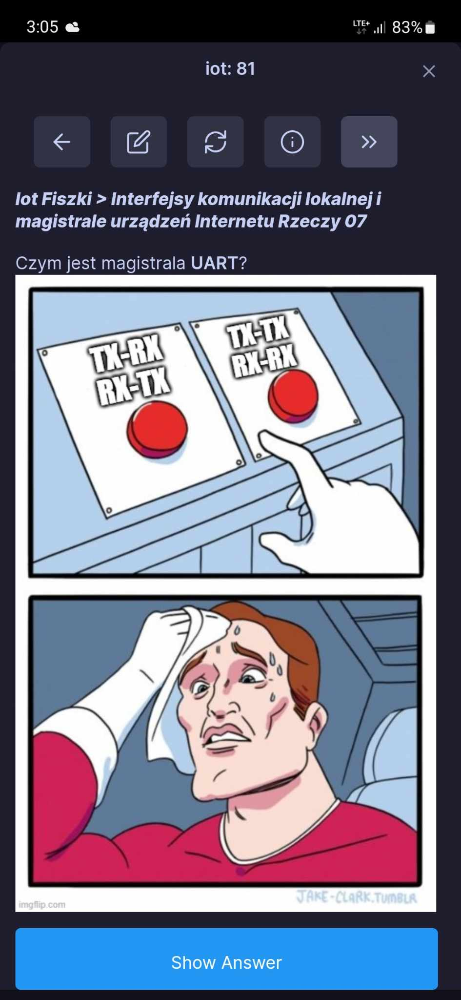
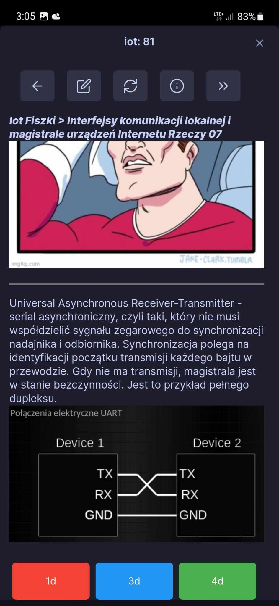

## Fiszki
Działa zarówno w wersji desktopowej jak i mobilnej

Aby móc wygodnie z tego korzystać zalecam pobrać repo, a następnie [otworzyć je jako vault (projekt obsidianowy)](./UruchomienieFIszek.mp4). 
Wszystkie potrzebne dodatki znajdują się w folderze .obsidian/ i zostaną automatycznie pobrane, także jedyne co trzeba zrobić to:
- na mobilkach: menu w prawym dolnym rogu -> `review flashcards`
- na pc: w pasku bocznym po lewej stronie ikona `review flashcards`

Przykładowa fiszka:

 

